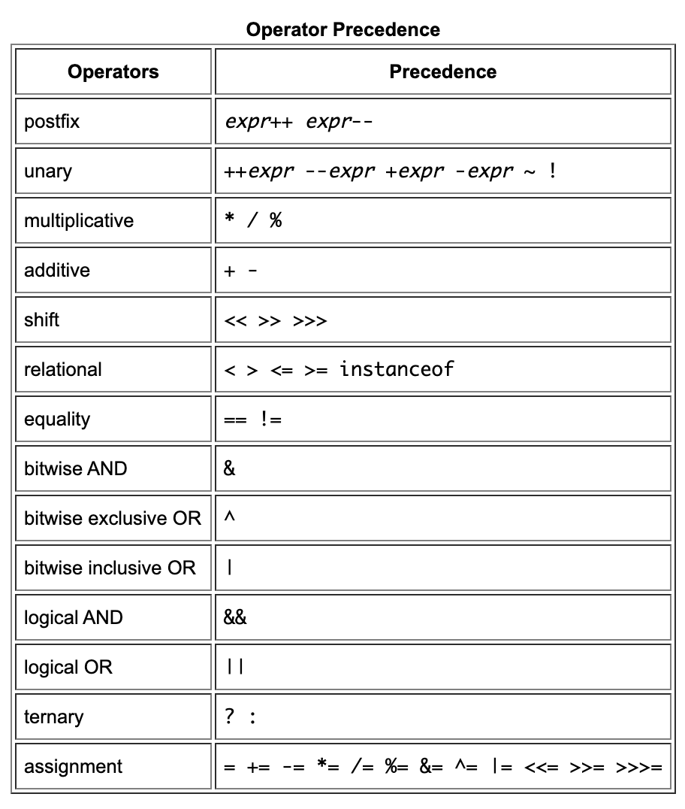

## Java Basics

### Language Basics

Variables
  - Instance Variables
    - Non-Static Fields
    - Values are unique to each instance of a class
  - Class Variables
    - Static Fields
    - Tells computer that there is exactly one instance of the variable in existence
  - Local Variables
    - ex: `int count = 0`
  - Parameters
    - ex: `public static void main(String[]args)`

Operators
  - special symbols that performs specific operations on one, two, or three operands, and then return a result. 

  
<!-- https://docs.oracle.com/javase/tutorial/java/nutsandbolts/operators.html -->

Expressions
  - constructs made up of variables, operators, and method invocations that are constructed according to the syntax of the language and evaluate a single value.

Statements
  - Roughly equivalent to sentences in natural languages
  - a complete unit of execution

Blocks
  - a group of zero or more statements between balanced braces 
  - can be used anywhere a single statement is allowed

Learn more [**HERE**](https://docs.oracle.com/javase/tutorial/java/nutsandbolts/index.html) and [**HERE!**](https://www.dummies.com/programming/java/making-sense-of-javas-api-documentation/)

Learn about compiling [**HERE**](https://www.reddit.com/r/explainlikeimfive/comments/233dq5/eli5_what_does_it_mean_to_compile_code/) and [**HERE!**](https://xkcd.com/303/)

[**Return to Home**](README.md)